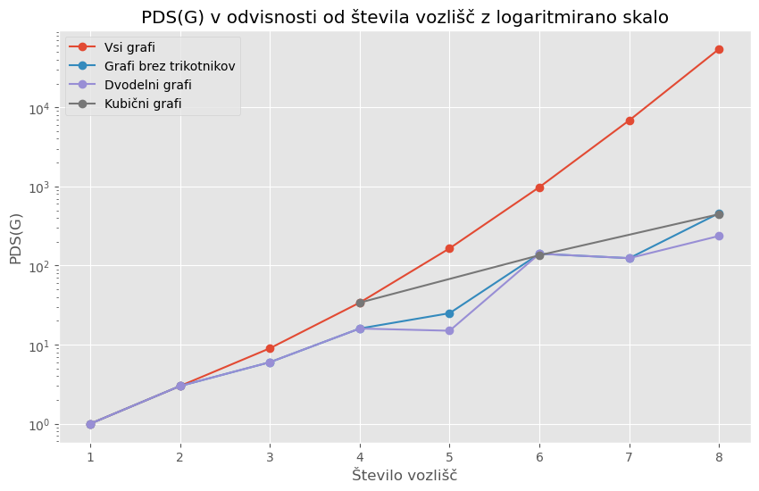

# PINGDINGSHAN'S NUMBER

## UVOD
(kratka predstavitev problema, opis generiranja in zbiranja podatkov - nauty geng, glavna ideja)
### Kratka predstavitev/opis problema
V okviru najinega projekta, sva iskala tako imenovano Pingdingshanovo število poznano tudi kot 'subpath-number'. To je število vseh poti v danem grafu, tudi trivialnih, torej poti dolžine 0. Tu je pot v grafu zaporedje vozlišč, kjer se ta ne smejo ponavljati. V jeziku Sage sva definirala algoritem PDS, ki  izračunava Pingdingshanovo število. Iskala sva ga le na povezanih grafih, kjer sva ločila in posebej obravnavala različne skupine grafov. Na vozliščih $i = 1, ... , 8$ sva za skupine kubičnih, dvodelnih, grafov brez trikotnikov in nazadnje še vseh grafov izračunala maksimalne vrednosti PDS-ja na posameznem vozlišču in nato te vrednosti primerjala med skupinami grafov. Dalje sva postavila hipotezo, katera skupina grafov bo imela največji PDS, nato pa naredila stohastično analizo, s pomočjo katere bova videla, ali se rezultati le-te skladajo z najino hipotezo, ali pa ji nasprotujejo. Argumentirala sva  rezultate stohastične analize in povzela ugotovitve.

### Generacija in zbiranje podatkov
#### Generacija
Za generacijo podatkov sva izbrala nauty.geng okolje, saj se nama je zdelo najbolj primerno iz večih razlogov. Funkcija nauty.geng ne zgenenrira vseh grafov, temveč zgolj generatorje za izbrane grafe na i vozliščih. To je bilo za najin program bolj učinkovito, saj si razen določenih grafov (tistih, ki so imeli največje pds število v posamezni skupini) nisva želela shraniti vseh grafov. To bi bilo za najin računalnik in program veliko prezahtevno, za občutek na 8 vozliščih je 268 435 456 možnih grafov. Poleg prezahtevnosti, pa je v prid ne shranjevanju potegnilo tudi dejstvo, da teh grafov za analizo Pingdingshanovega števila nisva potrebovala. Nauty.geng nama je torej omogočil, da si za vsako skupino pripraviva generatorje grafov na željenih vozliščih, nato pa z uporabo for zanke inzračunava pds števila za vsako skupino in si zapomniva zgolj največja pds števila v posameznih skupinah za pimerno število vozlišč. Nauty.geng kot argumente sprejme število vozlišč in poebne argumente za vsako od skupin grafov. Ti so navedeni pri posameznih skupinah. Funkcije za generacijo generatorjev grafov so med seboj zelo simetrične (vse kar se bistveno spremeni so argumenti v nauty.geng funkciji in določene specifike glede na skupino grafov) zato bova kot psavdo kodo navedla zgoraj omenjene funkcije zgolj za vse grafe.

PRIKAZ UPORABE NAUTY.GENG ZA PRIRPAVO GENERATORJEV:
```python
def gen_vsi_grafi():
    gen_vseh = []
    for i in range(1, 9):
        gen_vseh.append(graphs.nauty_geng(f"{i} -c"))
    return gen_vseh
```


#### Zbiranje oziroma shranjevanje
V najinem projektu naju je zanimala zgornja meja za pds števila na grafih v i vozlišči. Iz tega razloga sva se osredotočila samo na grafe, ki so v posameznih skupinah imeli maksimalno pds število, ter na njihove lastnosti. Te sva iz množice vseh grafov dobila tako, da sva najprej s poiskala največja pds števila na grafih z 1,2,...,8 za posamezne skupine nato pa si shranila zgolj graf v katerem je bila ta vrednost dosežena. Za shranjevanje teh grafov in njihovih vrednsoti pds števil se nama je zdel najbolj primere slovar. Tega sva zasnovala na način, da so bili ključi števila vozlišč od 1 do 8 (sprememba se pojavi pri kubičnih grafih), pripisane vrednosti pa pari (toupli), kjer je bil na prvem mestu graf s maksimalnim pds-jem, na drugem mestu pa ravno ta pds. MAnjša sprememb se je pojavila pri kubičnih grafih, katere lahko generiramo le na sodih vozliščih(več o kubičnih grafih v nadaljevaju).
PRIPRAVA SLOVARJA S POMOČJO GENERATORJEV ZA VSE GRAFE:
```python
def pds_vsi():
    slovar_vsi = {} 
    for grafi in gen_vsi_grafi:
        for G in grafi:
            maks = 0
            if pds(G) == max(maks, pds(G)):
                maks = pds(G)
        slovar_vsi[G.order()] = (G, maks)
    return slovar_vsi
```
Zgronja funkcija vrne sledeči slovar:
```python
{1: (Graph on 1 vertex, 1),
 2: (Graph on 2 vertices, 3),
 3: (Graph on 3 vertices, 9),
 4: (Graph on 4 vertices, 34),
 5: (Graph on 5 vertices, 165),
 6: (Graph on 6 vertices, 981),
 7: (Graph on 7 vertices, 6853),
 8: (Graph on 8 vertices, 54804)}
```

## 1 ISKANJE PDS-JA NA GRAFIH Z $i$ VOZLIŠČI, KJER JE $i = 1, 2, \dots ,8$
(algoritem PDS, skupine grafov - lastnosti grafov)

### 1. 1 ALGORITEM PDS
Za računanje Pingingshanovega števila posameznega grafa sva uporabila funkcijo $pds$. Ta za vhodni podatek sprejme graf $G$ in vrne njegovo Pingdingshanovo število. Vendar pa funkcija $pds$ kliče še eno dodatno funkcijo in sicer funkcijo $count_paths$, ki za vhodne podatke sprejme graf $G$, ter začetno in končno vozlišče, nato pa vrne število poti med tema vozliščema. Funkcija $pds$ nato uporabi $count\_paths$ na vseh parih vozlišč grafa $G$ in nato prišteva te vrednosti. Končen rezultat je torej Pingdingshanovo število. Tu bova navedla psevdokodo funkcije $count_paths$, ki izgleda takole: 

```python
def count_paths(G, start, end):

    stevilo_poti = 0
    trenutna_pot = []
    trenutna_sosedje = []

    while True:
        if start = end:
            stevilo_poti += 1

        else:
            if start is not in trenutna_pot:
                trenutna_pot.append(start)
                trenutna_sosedje.append(sosed(start))

        start = None

        while start is None:
            try:
                start = next(trenutna_sosedje[-1])
            except:
                trenutna_pot.pop()
                trenutna_sosedje.pop()
```


  
Algoritem ima na začetku število poti nastavljeno na 0, seznama trenutnih poti in sosedov vozlišč na trenutni poti pa sta prazna. Algoritem nato prične izvajanje z začetnim vozliščem. Nato gre v while zanko kjer se poganja, dokler se ne izračuna končno število poti med začetnim in končnim vozliščem. Znotraj te zanke najprej preveri, če je vozlišče enako končnemu in v tem primeru število poti poveča za 1, saj to pomeni, da je pridelal eno možno pot med začetnim in končnim vozliščem. Če pa vozlišče ni enako končnemu, algoritem pogleda ali je vozlišče že v seznamu trenutne poti, če ni ga doda na seznam trenutne poti, na seznam sosedov vozlišč na trenutni poti pa doda njegovega naslednika. Nato vozlišče nastavi na None in gre v novo while zanko, v kateri na novo definira vozlišče kot naslednika zadnjega vozlišča iz seznama trenutne poti, če to ne obstaja pa iz obeh seznamov vrže zadnji element in če je seznam trenutnih poti prazen, vrne do takrat zgrajeno število poti med vozliščema.

S pomočjo tega algoritma sva nato računala maksimalne vrednosti $pds$-jev znotraj posameznih družin grafov in jih med seboj primerjala.

### 1. 2 DVODELNI GRAFI
Dvodelni ali bipartitni graf $G = (V, E)$ je graf, katerega množico vozlišč $V$ lahko razdelimo v dve disjunktni množici $U$ in $W$, tako da za vsako povezavo $(u, w) \in E$ velja, da $u \in U$ in  $w \in W$. Torej je graf dvodelen, če lahko njegova vozlišča razdelimo v dve množici tako, da nobeni dve vozlišči iz iste množice nista povezani z robom. Dvodelne grafe sva pridelala tako, da sva z uporabo naty.geng paketa iz generatorjev grafov filtrirala dvodelne grafe. To sva storila s pomočjo vgrajene funkcije v Sage-u $is.bipartite(G)$, ki vrne $True$, če je graf dvodelen in $False$ sicer.

### 1. 3 KUBIČNI GRAFI
Za kubične grafe velja, da imajo vsa vozlišča v takem grafu stopnjo natanko 3 (pravimo jim tudi 3-regularni grafi). Lastnost kubičnih grafov je tudi, da jih lahko dobimo le na sodo mnogo vozliščih. Kubične grafe sva tako kot vse ostale zgenerirala pomočjo nauty.geng paketa v Sageu. Argument, ki ga moramo podati za generacijo kubičnih grafo s pomočjo nauty.geng je "-d3 -D3", kjer nam številka poleg -d pove najnižjo stopnjo za vsa vozlišča v grafu, številka poleg -D pa najvišjo. Ker so vsi kubični grafi 3 regularni moramo obe številki postaviti na 3.

### 1. 4 GRAFI BREZ TRIKOTNIKOV
Grafi brez trikotnikov oziroma grafi brez ciklov dolžine so definirani za vse možne $i = 1, 2, \dots ,8. Tudi te sva genenirala s pomočjo nauty.geng. Če želimo z nauty.geng zgenerirati grafe brez ciklov dolžine tri potrebujemo argument -t.

## 2 PRIMERJAVA PDS MED SKUPINAMI GRAFOV 
(graf, navedba hipoteze)

Za vsako družino grafov sva napisala funkcijo $max_pds()$, ki za vsakega od vozlišč $i = 1, \dots, 8$ izračuna maksimalno Pingdingshanovo število grafov znotraj te skupine. Vrednosti sva shranjevala v slovarje, kjer so ključi števila vozlišč, vrednosti pa maksimalna PDS. Slovar je torej oblike:

$$
\{1: \max\limits_{|V(G)|=1} PDS(G), \dots , 8: \max\limits_{|V(G)|=8} PDS(G)\}
$$

Nato sva izrisala graf, na katerem so rasti vseh $4$ skupin grafov v odvisnosti od števila vozlišč. Ker so bile razlike v maksimalnih številih $pds(G)$ med družinami grafov res velike, sva uporabila logaritmirano skalo. Namen tega je bil, da si lažje predstavljava, kateri grafi imajo večje število $pds$ in da sva potem lažje oblikovala hipotezo.



Kot je opazno iz grafa, je bilo največje število poti doseženih znotraj skupine z vsemi grafi, drugi sta bili skupini kubičnih grafov in grafov brez trikotnikov, najmanjše število poti pa je dosegala skupina dvodelnih grafov. Kot vemo ima vsako vozlišče v kubičnih grafih stopnjo vozlišča natanko tri, kar pomeni, da ima vsako vozlišče tri povezave. Če te primerjamo z dvodelnimi grafi, kjer stopnja vozlišč v povprečju nižja, lahko sklepamo, da večje število povezav v grafu pomeni manjše število vseh poti. 

Tu bova navedla najino hipotezo, ki je naslednja: največje število poti bodo imeli polni grafi, saj imajo največje število povezav. 

V nadaljevanju bova s stohastično analizo skušala to hipotezo potrditi ali ovreči.

## 3 STOHASTIČNA ANALIZA
(algoritem, primerjava pdsja orignalnih grafov z pdsjem novih)
Stohastične analize sva se lotila tako, da sva za posamezno skupino vsem grafom, v katerih so bili doseženi maksimumi za število pds odstanila naključno povezavo, ki ni bila most. Ta pogoj je ključen zato, da graf, ki nastane še vedno ostane povezan (analizirala sva namreč pds število na povezanih grafih). Če se na hitro spomnimo; povezava je most, če bi brez nje graf razpadel na več komponent. Najina hipoteza je, da več kot ima graf povezav višji bo njegov pds.Iz te hipoteze bi sledilo, da če grafu odstanimo povezavo se bo to precej poznalo tudi na njegovem pds številu. V tem razdelku projekta sva torej grafov odstanila naključno povezavo, izračunala pds novega grafa in izračunala razmerje med številov povezav v grafu in njegovim pds-jem. Zadnje sva naredila zato, da sva lahko opazovala kako hitro pada pds, če grafu odstanjujemo povezave. Vse to sva naredila s sledečimi funkcijami:
```python
import random
def odstranitev_povezave(graf):
    if not graf.edges():
        return graf
    else:
        mostovi = set(graf.bridges())
        vse_povezave = set(graf.edges())
        ne_most = vse_povezave - mostovi
        if not ne_most:
            return graf
        else:
            nak_pov = random.choice(list(ne_most))
            graf.delete_edge(nak_pov)
            return graf


def stevilo_povezav(slovar):
    slovar_povezav = {}
    for kljuc in slovar.keys():
        graf,maks = slovar[kljuc]
        slovar_povezav[kljuc]= graf.num_edges()
    return slovar_povezav


def razmerje(stevilo_povezav, slovar_pds):
    razmerja = {}
    for kljuc in stevilo_povezav:
        graf,stevilo = slovar_pds[kljuc]
        razmerja[kljuc] = stevilo_povezav[kljuc] / stevilo

    return razmerja
```
Poleg teh funkcij sva za vsako skupino grafov naredila tudi nov slovar spremenjenih grafov ( grafov z odstranjeno eno povezavo).
Primer generacije novega slovarja za vse grafe:

```python
def nov_grafi_vsi():
    spremenjeni_grafi = {}
    for kljuc in pds_vsi:
        graf, pds_grafa = pds_vsi[kljuc]
        kopija = graf.copy()
        nov_graf = odstranitev_povezave(kopija)
        nov_pds = pds(nov_graf)
        spremenjeni_grafi[kljuc] = (nov_graf, nov_pds)
    
    return spremenjeni_grafi
```
### 3. 1 RAZMERJA PDS(G) MED ORIGINALNIMI IN SPREMENJENIMI GRAFI
S pomočjo zgornjih funkcij in opisanega procesa sva prišla do slečih razmerij:

VSI GRAFI-nespremenjeni:
```python
{1: 0.0,
 2: 0.3333333333333333,
 3: 0.3333333333333333,
 4: 0.17647058823529413,
 5: 0.06060606060606061,
 6: 0.01529051987767584,
 7: 0.0030643513789581204,
 8: 0.0005109116122910736}
```
VSI GRAFI-spremenjeni:
```python
{1: 0.0,
 2: 0.3333333333333333,
 3: 0.3333333333333333,
 4: 0.21739130434782608,
 5: 0.07758620689655173,
 6: 0.019444444444444445,
 7: 0.0038299502106472617,
 8: 0.0006270174868210213}
```
DVODELNI GRAFI-nespremenjeni:
```python
{1: 0.0,
 2: 0.3333333333333333,
 3: 0.3333333333333333,
 4: 0.21739130434782608,
 5: 0.07758620689655173,
 6: 0.019444444444444445,
 7: 0.0038299502106472617,
 8: 0.0006270174868210213}
```
DVODELNI GRAFI-spremenjeni:
```python
{1: 0.0,
 2: 0.3333333333333333,
 3: 0.3333333333333333,
 4: 0.3,
 5: 0.26666666666666666,
 6: 0.09090909090909091,
 7: 0.10810810810810811,
 8: 0.06896551724137931}
```
GRAFI BREZ TRIKOTNIKOV - nespremenjeni:
```python
{1: 0.0,
 2: 0.3333333333333333,
 3: 0.3333333333333333,
 4: 0.25,
 5: 0.2,
 6: 0.06382978723404255,
 7: 0.07258064516129033,
 8: 0.02608695652173913}
```
GRAFI BREZ TRIKOTNIKOV - spremenjeni:
```python
{1: 0.0,
 2: 0.3333333333333333,
 3: 0.3333333333333333,
 4: 0.3,
 5: 0.26666666666666666,
 6: 0.09090909090909091,
 7: 0.10810810810810811,
 8: 0.04044117647058824}
```
KUBIČNI GRAFI - nespremenjeni:
```python
{4: 0.17647058823529413, 6: 0.06666666666666667,
8: 0.026905829596412557}
```
KUBIČNI GRAFI - spremenjeni: (OPOMBA: Če kubičnemu grafu odstanimo eno povezavo, ta ni več kubičen, saj v njem obstajata dve vozlišči, ki nimata več stopnje 3.)
```python
{4: 0.21739130434782608, 6: 0.09195402298850575,
8: 0.039285714285714285}
```
Če opazujemo vsa razmerja lahko opazimo, da so narasla, ker se je število povezav v števcu zmanjšalo samo za 1, moramo velike spremembe v razmerju pripisati imenovalcu. Kot vemo bo številka večja, če bo imenovalec manjši iz česar lahko sklepamo, da je pds število v spremenjenih grafih precej padlo. Opazimo tudi, da večje kot je število vozlišč bolj opazna je sprememba v razmerju. Pomembno se je zavedati tudi, da je funkcija, ki spreminja grafe nastavljena tako, da če ne najde povezave, ki ne bi bila most, ne osstani nobene (to pomeni, da vrne isti graf). Slednje je posebej pomembno za grafe brez trikotnikov na nižjih i-jih, pri katerih so vse povezave mostovi. V tem primeru ne bi bilo smiselno gledati pds-ja na spremenjenem grafu, saj ta avtomatično razpade.

## 4 POLNI GRAFI 
(podatki v prid hipoteze)

## ČASOVNA ZAHTEVNOST
Ker se število vseh možniih grafov, z večanjem števila vozlišč znatno veča, sva tu imela kar nekaj problemov z poganjanjem programov. Originalno sva imela namen testirati hipotezo na grafih do vključno $12$ vozlišč, a se je izkazalo, da se bo program izvajal preveč časa in sva se nato omejila na $8$ vozlišč. Kot je že bilo omenjeno zgoraj, je vseh možnih grafov na $8$ vozliščih preko $250$ milijonov, na $12$ vozliščih pa jih je že $2^{66}$, oziroma $7.378 \times 10^{19}$. Funkcija, ki opisuje rast števila vseh možnih grafov v odvisnosti od števila vozlišč je namreč enaka:

$f(n) = 2^{\frac{n(n-1)}{2}}$.

Časovno zahtevnost izvajanja programa sva zmanjšala tudi z uporabo paketa naugty.geng v Sage-u, ki ustavri zgolj generatorje grafov, grafov pa si ne zapomni. 

## ZAKLJUČEK
V okviru tega projekta je bil najin cilj bolje razumeti in opisati spreminjanje števila vseh poti v grafu v odvisnosti od števila vozlišč, števila povezav in nenazadnje tipa grafa. Skozi eksperimentacijo na $4$ družinah grafov sva med njimi primerjala število vseh poti, nato pa sva število vseh poti primerjala še znotraj posameznih družin. Rezultati, ki sva jih dobila, gredo v prid najini hipotezi, torej da imajo polni grafi največje število vseh poti, saj imajo največ povezav in se zato število vseh poti med posameznima vozliščema poveča. Kljub temu pa sva hipotezo testirala na razmeroma majhnem številu grafov in zato ne drži nujno. 


